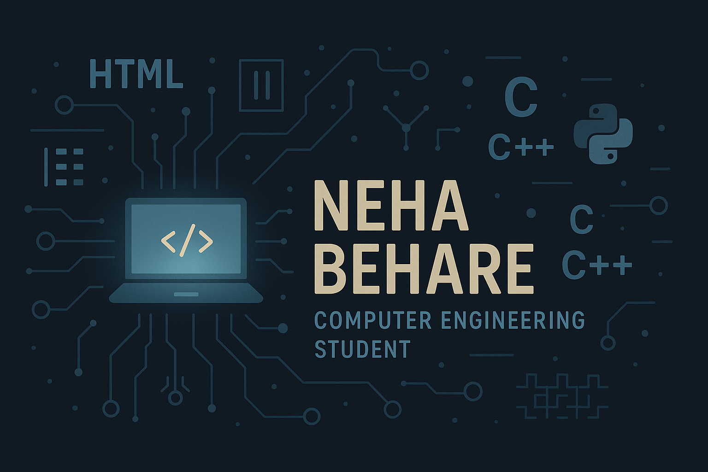

<h1 align="center">Hi 👋, I'm Neha Sanjay Behare</h1>
<h3 align="center">Code Enthusiast | Exploring C, C++, Python | Interested in Web Dev & Python</h3>

  

- 🎓 I'm currently in my **third year of Computer Engineering**, learning and building small projects.
- 🌱 I’m currently learning **Web Development, Python, and refining my C/C++ skills**
- 💬 Ask me about **C, C++, Python, HTML, CSS, Web Dev**
- 📫 Reach me at **nehabehere.2006@gmail.com**
- ⚡ Fun fact: *I may get stuck in code sometimes, but once I solve it — it's like giving a high-five to my future self! ✨🧠💖*

---

<h3 align="left">Connect with me:</h3>

  

---

<h3 align="left">Languages and Tools:</h3>

  
  
  
  
  
  

---

&nbsp;

